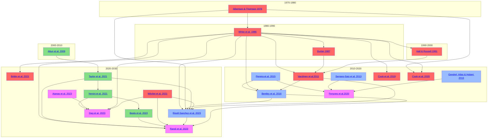

```mermaid
flowchart TD
    classDef anat fill:#ff6666
    classDef gene fill:#85e085
    classDef es fill:#99bbff
    classDef func fill:#ff80ff


    subgraph 1970-1980
    A1[<a href='http://openworm.org/ConnectomeToolbox/Albertson_1976/' >Albertson & Thomson 1976</a>]:::anat
    end
    subgraph 1980-1990
    A[<a href='http://openworm.org/ConnectomeToolbox/White_1986/' >White et al. 1986</a>]:::anat & B[<a href='http://openworm.org/ConnectomeToolbox/Durbin_1987/' >Durbin 1987</a>]:::anat
    end

    subgraph 1990-2000
    A2[<a href='http://openworm.org/ConnectomeToolbox/Hall_1991/' >Hall & Russell 1991</a>]:::anat
    end

    subgraph 2000-2010
    C[<a href='http://openworm.org/ConnectomeToolbox/Altun_2009/' >Altun et al. 2009</a>]:::gene 
    end

    subgraph 2010-2020
    D[<a href='http://openworm.org/ConnectomeToolbox/Varshney_2011/' >Varshney et al.2011</a>]:::anat & E[<a href='http://openworm.org/ConnectomeToolbox/Pereira_2015/' >Pereira et al. 2015</a>]:::es & E1[<a href='http://openworm.org/ConnectomeToolbox/Serrano_2013/' >Serrano-Saiz et al. 2013</a>]:::es  & E2[<a href='http://openworm.org/ConnectomeToolbox/Gendrel_2016/' >Gendrel, Atlas & Hobert 2016</a>]:::es & F[<a href='http://openworm.org/ConnectomeToolbox/Bentley_2016/' >Bentley et al. 2016 </a>]:::es & G[<a href='http://openworm.org/ConnectomeToolbox/Cook_2019/' >Cook et al. 2019</a>]:::anat & H[<a href='http://openworm.org/ConnectomeToolbox/Fenyves_2020/' >Fenyves et al.2020</a>]:::func & I[<a href='http://openworm.org/ConnectomeToolbox/Cook_2020/' >Cook et al. 2020</a>]:::anat
    end

    subgraph 2020-2030
    J[<a href='http://openworm.org/ConnectomeToolbox/Brittin_2021' >Brittin et al. 2021</a>]:::anat & K[<a href='http://openworm.org/ConnectomeToolbox/Witvliet_2021' >Witvliet et al. 2021</a>]:::anat & L[<a href='http://openworm.org/ConnectomeToolbox/Taylor_2021' >Taylor et al. 2021</a>]:::gene & M[<a href='http://openworm.org/ConnectomeToolbox/Yemini_2021' >Yemini et al. 2021</a>]:::gene & N[<a href='http://openworm.org/ConnectomeToolbox/Beets_2023' >Beets et al. 2023</a>]:::gene & P[<a href='http://openworm.org/ConnectomeToolbox/Randi_2023' >Randi et al. 2023</a>]:::func & NP[<a href='http://openworm.org/ConnectomeToolbox/Ripoll_2023' >Ripoll-Sanchez et al. 2023</a>]:::es & R[<a href='http://openworm.org/ConnectomeToolbox/Dag_2023' >Dag et al. 2023</a>]:::func & T[<a href='http://openworm.org/ConnectomeToolbox/Atanas_2023' >Atanas et al. 2023</a>]:::func
    end     


    E --> H
    E1 --> H
    E2 --> H
    E --> F
    C --> L
    L --> M
    M --> N
    A --> B
    A1 --> A
    A1 --> I
    A  --> A2
    A --> D
    B --> D
    A2 --> D
    A --> G
    A --> I
    A --> J
    A --> F
    D --> F
    A --> NP
    A1 --> NP
    F --> NP
    L --> NP
    K --> NP
    D --> NP
    A --> P
    L --> P
    N --> P
    K --> P
    NP --> P
    F --> P
    M --> R
    T --> R
    A --> R
    K --> R
```
