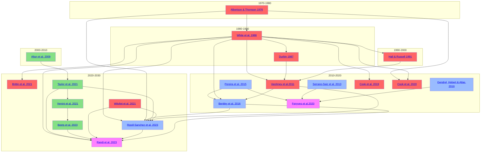

```mermaid
flowchart TD
    classDef anat fill:#ff6666
    classDef gene fill:#85e085
    classDef es fill:#99bbff
    classDef func fill:#ff80ff


    subgraph 1970-1980
    A1[<a href='https://github.com/yasinthanvickneswaran/ConnectomeToolbox/blob/main/docs/Albertson_Thompson_1976.md' >Albertson & Thomson 1976</a>]:::anat
    end
    subgraph 1980-1990
    A[<a href='https://github.com/yasinthanvickneswaran/ConnectomeToolbox/blob/main/docs/White_1986.md' >White et al. 1986</a>]:::anat & B[<a href='https://github.com/yasinthanvickneswaran/ConnectomeToolbox/blob/main/docs/Durbin_1987.md' >Durbin 1987</a>]:::anat
    end

    subgraph 1990-2000
    A2[<a href='https://github.com/yasinthanvickneswaran/ConnectomeToolbox/blob/main/docs/Hall_1991.md' >Hall & Russell 1991</a>]:::anat
    end

    subgraph 2000-2010
    C[<a href='https://github.com/yasinthanvickneswaran/ConnectomeToolbox/blob/main/docs/Altun_2009.md' >Altun et al. 2009</a>]:::gene 
    end

    subgraph 2010-2020
    D[<a href='https://github.com/yasinthanvickneswaran/ConnectomeToolbox/blob/main/docs/Varshney_2011.md' >Varshney et al.2011</a>]:::anat & E[<a href='https://github.com/yasinthanvickneswaran/ConnectomeToolbox/blob/main/docs/Pereira_2015.md' >Pereira et al. 2015</a>]:::es & E1[<a href='https://github.com/yasinthanvickneswaran/ConnectomeToolbox/blob/main/docs/Serrano_2013.md' >Serrano-Saiz et al. 2013</a>]:::es  & E2[<a href='https://github.com/yasinthanvickneswaran/ConnectomeToolbox/blob/main/docs/Gendrel_2016.md' >Gendrel, Hobert & Atlas 2016</a>]:::es & F[<a href='https://github.com/yasinthanvickneswaran/ConnectomeToolbox/blob/main/docs/Bentley_2016.md' >Bentley et al. 2016 </a>]:::es & G[<a href='https://github.com/yasinthanvickneswaran/ConnectomeToolbox/blob/main/docs/Cook_2019.md' >Cook et al. 2019</a>]:::anat & H[<a href='https://github.com/yasinthanvickneswaran/ConnectomeToolbox/blob/main/docs/Fenyves_2020.md' >Fenyves et al.2020</a>]:::func & I[<a href='https://github.com/yasinthanvickneswaran/ConnectomeToolbox/blob/main/docs/Cook_2020.md' >Cook et al. 2020</a>]:::anat
    end

    subgraph 2020-2030
    J[<a href='https://github.com/yasinthanvickneswaran/ConnectomeToolbox/blob/main/docs/Brittin_2021.md' >Brittin et al. 2021</a>]:::anat & K[<a href='https://github.com/yasinthanvickneswaran/ConnectomeToolbox/blob/main/docs/Witvliet_2021.md' >Witvliet et al. 2021</a>]:::anat & L[<a href='https://github.com/yasinthanvickneswaran/ConnectomeToolbox/blob/main/docs/Taylor_2021.md' >Taylor et al. 2021</a>]:::gene & M[<a href='https://github.com/yasinthanvickneswaran/ConnectomeToolbox/blob/main/docs/Yemini_2021.md' >Yemini et al. 2021</a>]:::gene & N[<a href='https://github.com/yasinthanvickneswaran/ConnectomeToolbox/blob/main/docs/Beets_2023.md' >Beets et al. 2023</a>]:::gene & P[<a href='https://github.com/yasinthanvickneswaran/ConnectomeToolbox/blob/main/docs/Randi_2023.md' >Randi et al. 2023</a>]:::func & NP[<a href='https://github.com/yasinthanvickneswaran/ConnectomeToolbox/blob/main/docs/Ripoll_2023.md' >Ripoll-Sanchez et al. 2023</a>]:::es
    end     


    E --> H
    E1 --> H
    E2 --> H
    E --> F
    C --> L
    L --> M
    M --> N
    A --> B
    A1 --> A
    A1 --> I
    A  --> A2
    A --> D
    B --> D
    A2 --> D
    A --> G
    A --> I
    A --> J
    A --> F
    D --> F
    A --> NP
    A1 --> NP
    F --> NP
    L --> NP
    K --> NP
    D --> NP
    A --> P
    L --> P
    N --> P
    K --> P
    NP --> P
    F --> P

    
    
```
