# Overview

Information on published connectomics data related to _C. elegans_. This is being developed as part of the [OpenWorm project](https://www.openworm.org).

**Please note: this is a <u>Work in Progress</u>! Please contact padraig -at- openworm.org if you are interested in contributing to this work.**

``` plotly
{"file_path": "../assets/contour.json"}
```

```mermaid
flowchart TD
    classDef anat fill:#ff6666
    classDef gene fill:#85e085
    classDef es fill:#99bbff
    classDef func fill:#ff80ff


    subgraph 1970-1980
    A1[<a href='http://openworm.org/ConnectomeToolbox/Albertson_1976/' >Albertson & Thomson 1976</a>]:::anat
    end
    subgraph 1980-1990
    A[<a href='http://openworm.org/ConnectomeToolbox/White_1986/' >White et al. 1986</a>]:::anat & B[<a href='http://openworm.org/ConnectomeToolbox/Durbin_1987/' >Durbin 1987</a>]:::anat
    end

    subgraph 1990-2000
    A2[<a href='http://openworm.org/ConnectomeToolbox/Hall_1991/' >Hall & Russell 1991</a>]:::anat
    end

    subgraph 2000-2010
    C[<a href='http://openworm.org/ConnectomeToolbox/Altun_2009/' >Altun et al. 2009</a>]:::gene 
    end

    subgraph 2010-2020
    D[<a href='http://openworm.org/ConnectomeToolbox/Varshney_2011/' >Varshney et al.2011</a>]:::anat & E[<a href='http://openworm.org/ConnectomeToolbox/Pereira_2015/' >Pereira et al. 2015</a>]:::es & E1[<a href='http://openworm.org/ConnectomeToolbox/Serrano_2013/' >Serrano-Saiz et al. 2013</a>]:::es  & E2[<a href='http://openworm.org/ConnectomeToolbox/Gendrel_2016/' >Gendrel, Hobert & Atlas 2016</a>]:::es & F[<a href='http://openworm.org/ConnectomeToolbox/Bentley_2016/' >Bentley et al. 2016 </a>]:::es & G[<a href='http://openworm.org/ConnectomeToolbox/Cook_2019/' >Cook et al. 2019</a>]:::anat & H[<a href='http://openworm.org/ConnectomeToolbox/Fenyves_2020/' >Fenyves et al.2020</a>]:::func & I[<a href='http://openworm.org/ConnectomeToolbox/Cook_2020/' >Cook et al. 2020</a>]:::anat
    end

    subgraph 2020-2030
    J[<a href='http://openworm.org/ConnectomeToolbox/Brittin_2021' >Brittin et al. 2021</a>]:::anat & K[<a href='http://openworm.org/ConnectomeToolbox/Witvliet_2021' >Witvliet et al. 2021</a>]:::anat & L[<a href='http://openworm.org/ConnectomeToolbox/Taylor_2021' >Taylor et al. 2021</a>]:::gene & M[<a href='http://openworm.org/ConnectomeToolbox/Yemini_2021' >Yemini et al. 2021</a>]:::gene & N[<a href='http://openworm.org/ConnectomeToolbox/Beets_2023' >Beets et al. 2023</a>]:::gene & P[<a href='http://openworm.org/ConnectomeToolbox/Randi_2023' >Randi et al. 2023</a>]:::func & NP[<a href='http://openworm.org/ConnectomeToolbox/Ripoll_2023' >Ripoll-Sanchez et al. 2023</a>]:::es & R[<a href='http://openworm.org/ConnectomeToolbox/Dag_2023' >Dag et al. 2023</a>]:::func & T[<a href='http://openworm.org/ConnectomeToolbox/Atanas_2023' >Atanas et al. 2023</a>]:::func
    end     


    E --> H
    E1 --> H
    E2 --> H
    E --> F
    C --> L
    L --> M
    M --> N
    A --> B
    A1 --> A
    A1 --> I
    A  --> A2
    A --> D
    B --> D
    A2 --> D
    A --> G
    A --> I
    A --> J
    A --> F
    D --> F
    A --> NP
    A1 --> NP
    F --> NP
    L --> NP
    K --> NP
    D --> NP
    A --> P
    L --> P
    N --> P
    K --> P
    NP --> P
    F --> P
    M --> R
    T --> R
    A --> R
    K --> R
```



## Datasets

| Papers                                                     | Features      | Datasets      | Readers |
| -------------                                              | -----         | -----         | ---- |
| [Albertson & Thomson 1976](Albertson_1976.md)     | Anatomical | N/A |  N/A |
| [White et al. 1986](White_1986.md)     | Anatomical |[N2U.txt](https://github.com/dwitvliet/nature2021/blob/0646af9d25896ae660f97d462eab2d67282f5625/data/legacy_data/wormwiring_N2U.txt)|  N/A |
| [Durbin 1987](Durbin_1987.md)    | Anatomical |[Durbin.txt](https://github.com/dwitvliet/nature2021/blob/0646af9d25896ae660f97d462eab2d67282f5625/data/legacy_data/durbin.txt)| N/A |
| [Hall & Russell 1991](Hall_1991.md)     | Anatomical | N/A |  N/A |
| [Altun et al. 2009](Altun_2009.md)   | Gene Expression |[Db.dump](datasets/neurons/Modified_celegans_db_dump.csv)| [OpenWormReader](https://github.com/yasinthanvickneswaran/c302/blob/7c7fc016c73c500567c94414ee0b7f7a4829084f/c302/OpenWormReader.py) |
| [Varshney et al. 2011](Varshney_2011.md)  | Anatomical | [NeuronsConnect](datasets/neurons/NeuronConnectFormatted(1).xlsx)   | [SpreadsheetDataReader](https://github.com/yasinthanvickneswaran/c302/blob/7c7fc016c73c500567c94414ee0b7f7a4829084f/c302/SpreadsheetDataReader.py) |
| [Pereira et al. 2015](Pereira_2015.md)  | Extrasynaptic |[Cholinergic neurons](https://doi.org/10.7554/eLife.12432.003) [NT_Map_herm](https://doi.org/10.7554/eLife.12432.009) [WormWiring](https://doi.org/10.7554/eLife.12432.010) [male_cholinergic](https://doi.org/10.7554/eLife.12432.016) [transcriptional_regulators](https://doi.org/10.7554/eLife.12432.019)| N/A |
| [Bentley et al. 2016](Bentley_2016.md)  | Extrasynaptic | [csv](datasets/neurons/Bentley_et_al_2016_expression.csv) | N/A |
| [Cook et al. 2019](Cook_2019.md)          | Anatomical |[herm_full_edgelist.csv](datasets/neurons/herm_full_edgelist.csv) | [UpdatedSpreadsheetDataReader](https://github.com/yasinthanvickneswaran/c302/blob/7c7fc016c73c500567c94414ee0b7f7a4829084f/c302/UpdatedSpreadsheetDataReader.py) [UpdatedSpreadsheetDataReader2](https://github.com/yasinthanvickneswaran/c302/blob/7c7fc016c73c500567c94414ee0b7f7a4829084f/c302/UpdatedSpreadsheetDataReader2.py) |
| [Fenyves et al. 2020](Fenyves_2020.md)    | Functional | [data](https://github.com/francescorandi/wormneuroatlas/blob/main/wormneuroatlas/data/journal.pcbi.1007974.s003.xlsx) | N/A  |
| [Cook et al. 2020](Cook_2020.md)    | Anatomical | [data]() | N/A  |
| [Brittin et al. 2021](Brittin_2021.md)    | Anatomical | [data](https://github.com/cabrittin/elegansbrainmap/tree/049a26a094e085bacc70f5b05ea04a007d00eb2c/data) [parsed](https://github.com/cabrittin/parsetrakem2)| N/A  |
| [Witvliet et al. 2021](Witvliet_2021.md)  | Developmental | [physical.csv](https://github.com/dwitvliet/nature2021/tree/0646af9d25896ae660f97d462eab2d67282f5625/data/physical_contact) [synapses.json](https://github.com/dwitvliet/nature2021/tree/0646af9d25896ae660f97d462eab2d67282f5625/data/synapses) [skeletons.json](https://github.com/dwitvliet/nature2021/tree/0646af9d25896ae660f97d462eab2d67282f5625/data/skeletons) | N/A |
| [Taylor et al. 2021](Taylor_2021.md)    | Gene Expression | [data](https://github.com/cengenproject/CeNGEN_integrated_analysis_biorxiv_code) | N/A  |
| [Yemini et al. 2021](Yemini_2021.md)    | Gene Expression | [data](https://zenodo.org/records/3906530) | N/A  |
| [Beets et al. 2023](Beets_2023.md)    | Gene Expression | [data](https://github.com/cengenproject/CeNGEN_integrated_analysis_biorxiv_code) | N/A  |
| [Dag et al. 2023](Dag_2023.md)    | Functional | N/A | N/A  |
| [Atanas et al. 2023](Atanas_2023.md)    | Functional | [data](https://www.wormwideweb.org/dataset.html) | N/A  |
| [Randi et al. 2023](Randi_2023.md)    | Functional | [data]() | N/A  |
| [Ripoll-Sanchez et al. 2023](Ripoll_2023.md)    | Functional | [data]() | N/A  |


