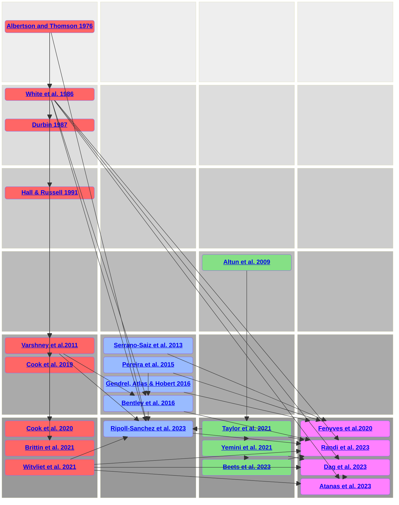
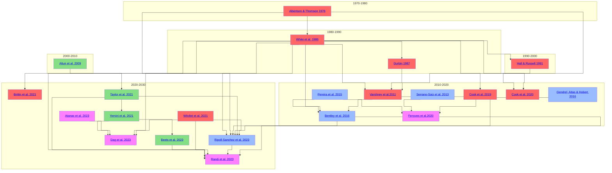

# Overview

Information on published connectomics data related to _C. elegans_. This is being developed as part of the [OpenWorm project](https://www.openworm.org).

**Please note: this is a <u>Work in Progress</u>! Please [get in contact](About.md) if you are interested in contributing to this resource!**

### Example plots

Some of the generated views of the connectomics datasets covered here. Click on the images for more details.

<a href="Cook2019Male_data_graph/#electrical"></img></a>
<a href="RipollSanchezShortRange_data"></img></a>
<a href="Escape_Cook2019Herm_data_graph/#chemical-exc"></img></a>
<a href="Cook2020_data_hiveplot/#chemical"></img></a>

### Historical publications on _C. elegans_ connectomics

Another view on the data

### Datasets

| Papers                                                     | Features      | Datasets |
| -------------                                              | -----         | ---- |
| [Albertson & Thomson 1976](Albertson_1976.md)     | Anatomical | N/A |
| **[White et al. 1986](White_1986.md)**     | Anatomical | **[White_A](White_A_data.md) - [White_L4](White_L4_data.md) -  [White_whole](White_whole_data.md)** |
| [Durbin 1987](Durbin_1987.md)    | Anatomical | *Work in progress: [Durbin.txt](https://github.com/dwitvliet/nature2021/blob/0646af9d25896ae660f97d462eab2d67282f5625/data/legacy_data/durbin.txt)* |
| [Hall & Russell 1991](Hall_1991.md)     | Anatomical | N/A |
| [Altun et al. 2009](Altun_2009.md)   | Gene Expression |  *Work in progress: [data](https://docs.google.com/spreadsheets/d/1Jc9pOJAce8DdcgkTgkUXafhsBQdrer2Y47zrHsxlqWg/edit?gid=283505544#gid=283505544)* |
| **[Varshney et al. 2011](Varshney_2011.md)**  | Anatomical | **[Varshney 2011](Varshney_data.md)** |
| [Pereira et al. 2015](Pereira_2015.md)  | Extrasynaptic | *Work in progress: [Cholinergic neurons](https://doi.org/10.7554/eLife.12432.003) - [NT_Map_herm](https://doi.org/10.7554/eLife.12432.009) - [WormWiring](https://doi.org/10.7554/eLife.12432.010) - [male_cholinergic](https://doi.org/10.7554/eLife.12432.016) - [transcriptional_regulators](https://doi.org/10.7554/eLife.12432.019)* |
| **[Bentley et al. 2016](Bentley_2016.md)**  | Extrasynaptic | **[Bentley et al. 2016 Monoaminergic](Bentley2016_MA_data_graph.md)** - **[Bentley et al. 2016 Peptidergic](Bentley2016_PEP_data_graph.md)** |
| **[Cook et al. 2019](Cook_2019.md)**          | Anatomical | **[Cook 2019 Hermaphrodite](Cook2019Herm_data.md)** - **[Cook 2019 Male](Cook2019Male_data.md)** |
| **[Cook et al. 2020](Cook_2020.md)**   | Anatomical | **[Cook 2020](Cook2020_data.md)**  |
| [Fenyves et al. 2020](Fenyves_2020.md)    | Functional | *Work in progress: [data](https://github.com/francescorandi/wormneuroatlas/blob/main/wormneuroatlas/data/journal.pcbi.1007974.s003.xlsx)*   |
| **[Brittin et al. 2021](Brittin_2021.md)**    | Anatomical | **[Brittin et al. 2021](Brittin2021_data.md)**  |
| [Taylor et al. 2021](Taylor_2021.md)    | Gene Expression | *Work in progress: [data](https://github.com/cengenproject/CeNGEN_integrated_analysis_biorxiv_code)* |
| [Yemini et al. 2021](Yemini_2021.md)    | Gene Expression | *Work in progress: [data](https://zenodo.org/records/3906530)* |
| **[Witvliet et al. 2021](Witvliet_2021.md)**  | Developmental | **[Witvliet1](Witvliet1_data.md)** - **[Witvliet2](Witvliet2_data.md)** - **[Witvliet3](Witvliet3_data.md)** - **[Witvliet4](Witvliet4_data.md)** - **[Witvliet5](Witvliet5_data.md)** - **[Witvliet6](Witvliet6_data.md)** - **[Witvliet7](Witvliet7_data.md)** - **[Witvliet8](Witvliet8_data.md)**|
| [Beets et al. 2023](Beets_2023.md)    | Gene Expression | *Work in progress: [data](https://github.com/cengenproject/CeNGEN_integrated_analysis_biorxiv_code)* |
| [Dag et al. 2023](Dag_2023.md)    | Functional | N/A  |
| [Atanas et al. 2023](Atanas_2023.md)    | Functional | *Work in progress: [data](https://www.wormwideweb.org/dataset.html)* |
| **[Randi et al. 2023](Randi_2023.md)**    | Functional | **[WormNeuroAtlas: anatomical](WormNeuroAtlas_data.md)** -  **[WormNeuroAtlas: functional](Randi2023_data_graph.md)**  |
| **[Ripoll-Sanchez et al. 2023](RipollSanchez_2023.md)**    | Extrasynaptic | **[Ripoll-Sánchez 2023 (short)](RipollSanchezShortRange_data.md) - [Ripoll-Sánchez 2023 (mid)](RipollSanchezMidRange_data.md) - [Ripoll-Sánchez 2023 (long)](RipollSanchezLongRange_data.md)**   |

